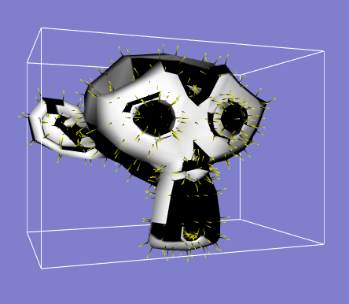
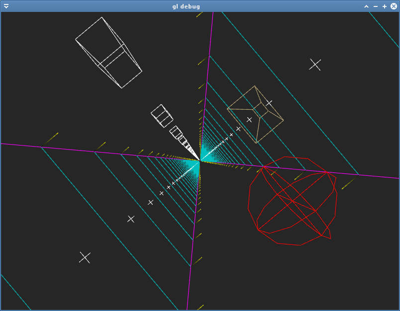
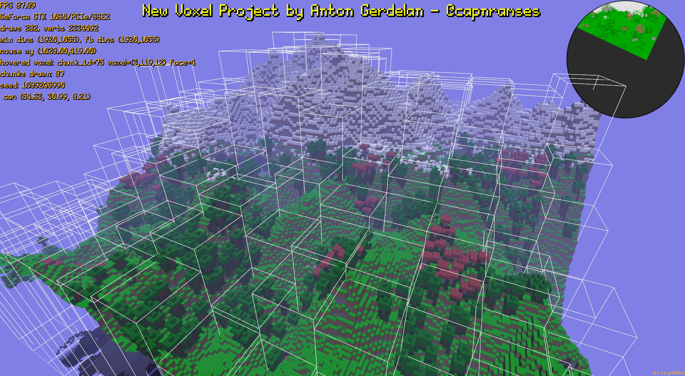

# apg_gldb: OpenGL Debug Drawing Functions



My own spin on the drop-in code everyone does to draw lines and stuff to help
debug vectors and things as they happen.

Runs on most hardware supporting OpenGL 2.1 and newer.

The code to draw normals and show the AABB in the screenshot above is:
```
// Debug mesh normals.
float* pp = vp;
float* nn = vn;
float ss = 0.1f;
float yellow[] = { 1.0f, 1.0f, 0.0f, 1.0f };
for ( int i = 0; i < point_count; i++ ) {
	apg_gldb_add_normal( nn, pp, ss, yellow );
	pp += 3;
	nn += 3;
}
// Debug AABB.
float white[] = { 1.0f, 1.0f, 1.0f, 1.0f };
float min_xyz[] = { -1.352f, -0.969f, -0.852f };
float max_xyz[] = { 1.352f, 0.93f, 0.836f };
apg_gldb_add_aabb( min_xyz, max_xyz, white );
```
Where `ss` is the scale I want the lines for the normals to have, `vp` is the array of vertex points, and `vn` is the array of vertex normals.

## Stuff supported so far:



* Accept camera matrices so line points are defaulted to world space.
* 3D lines with colours.
* Normals shown as 3D line starting at given 3D point, in normal direction for
given scale, and coloured from black to colour in direction of normal.
* 3D positions as a 3D t-shape sort of thing (lines).
* Axis-aligned bounding box (lines).
* Sphere represented as 3D cross and 3 circles of lines.
* Draw a frustum box based on corner points.
* Functions to modify previously created lines, AABB, and frustum.

## Design Thinking

My thinking was to maintain one gigantic buffer with all of the lines
points and colours. Then I can draw the entire lot in one pass.

I don't have a ```remove_line()``` - you just wipe the whole lot arbitrarily.
You can update previously added lines.

## Example Use-Case



I used this in a couple of projects to test frustum culling, where you can 'freeze' the camera, and draw the
previous frustum as well as the bounds of objects used for culling.