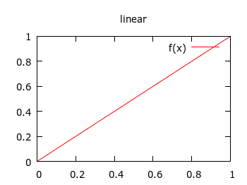
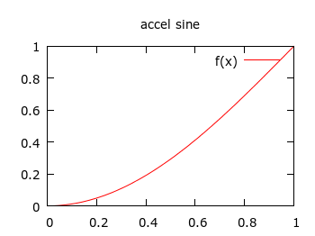
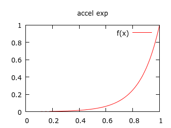
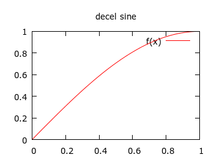
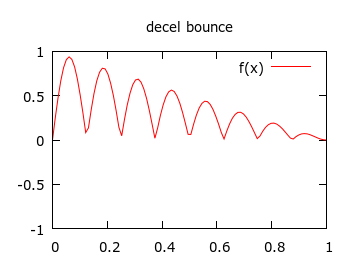

# apg_interp #

A small library of interpolation functions for animations, and transitions
between different numbers.

Libraries exist for "tweening" and "easing" functions, but I didn't like the
interfaces, nor the mathematics used, so I made my own, simplified, library that
has names and parameters that are more intuitive to me, and more pure functions.

C99 and JavaScript ports are here.

I wrote a blog post about this http://antongerdelan.net/blog/formatted/2015_03_18_interpolation.html

## functions ##

* `clamp` - useful to constrain function range
* `lerp` - linear interpolation
* `accel_sine` - the same as "easeInSine"
* `accel_exp` - the same as "easeInExpo"
* `bow_string` - similar to "easeInBack"
* `decel_sine` - the same as "easeOutSine"
* `decel_elastic` - similar to "easeOutElastic" but with no lead-up
* `decel_bounce` - similar to "easeOutBounce" but with no lead-up

## To Do ##

* add an `n` parameter to bounce and elastic functions to set the number ofwaves in the domain.
* make a chart for `bow_string`
